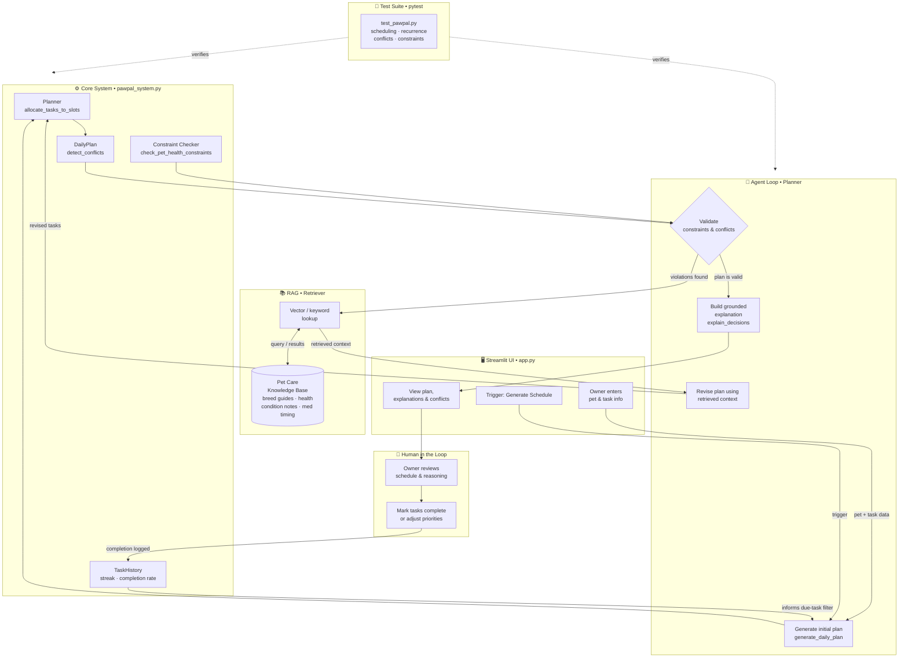

# PawPal+ — Enhanced System Architecture

The diagram below shows how the AI enhancements (Agentic Workflow + RAG) integrate with the existing scheduling system.

## Flow summary

| Stage | What happens |
|---|---|
| **Input** | Owner adds pets and tasks via the Streamlit UI |
| **Agent loop** | Generates a plan, validates it, and iterates until constraints are satisfied |
| **RAG lookup** | When a violation is found, the retriever pulls relevant pet-care context from the knowledge base to inform the revision |
| **Output** | A conflict-free, grounded daily schedule with natural-language explanations |
| **Human review** | Owner reads the plan, marks tasks complete; completions feed back into `TaskHistory` |
| **Testing** | `pytest` suite independently verifies the core scheduling logic and agent behavior |
