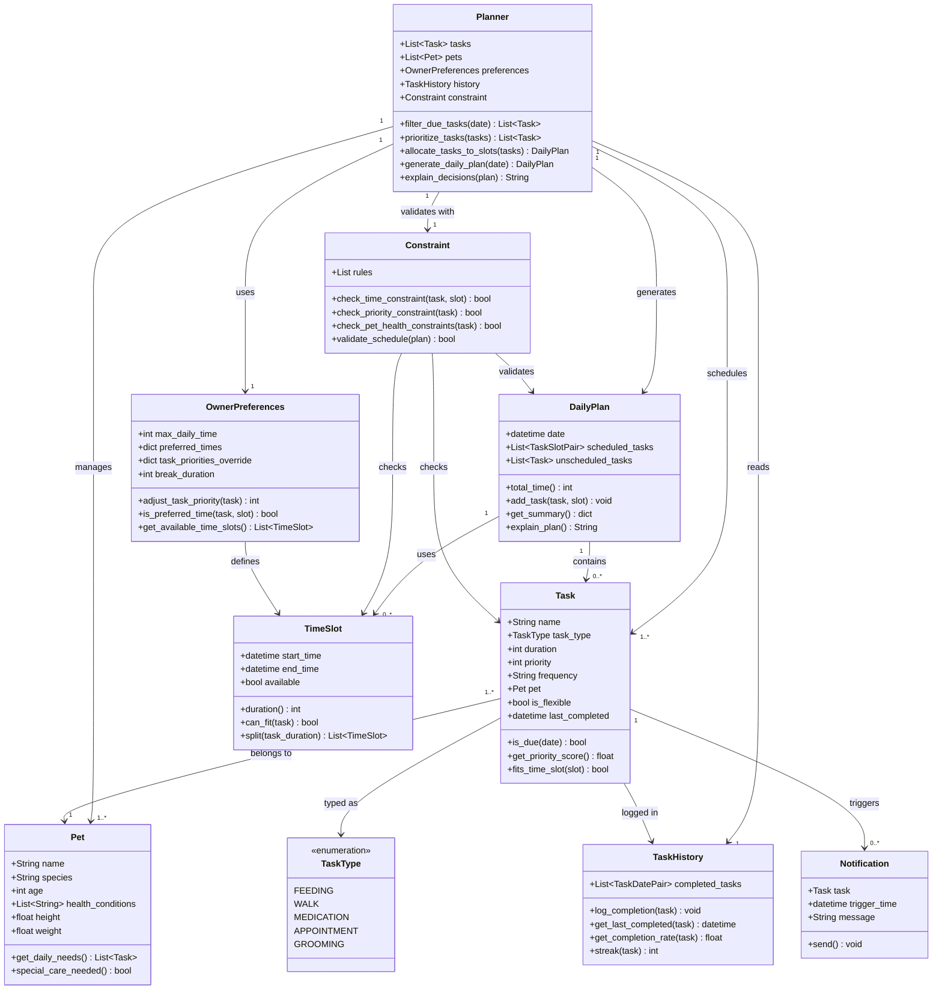

# PawPal+ Class Diagram

```mermaid
classDiagram
    class TaskType {
        <<enumeration>>
        FEEDING
        WALK
        MEDICATION
        APPOINTMENT
        GROOMING
    }

    class Pet {
        +String name
        +String species
        +int age
        +List~String~ health_conditions
        +float height
        +float weight
        +get_daily_needs() List~Task~
        +special_care_needed() bool
    }

    class Task {
        +String name
        +TaskType task_type
        +int duration
        +int priority
        +String frequency
        +Pet pet
        +bool is_flexible
        +datetime last_completed
        +is_due(date) bool
        +get_priority_score() float
        +fits_time_slot(slot) bool
    }

    class TimeSlot {
        +datetime start_time
        +datetime end_time
        +bool available
        +duration() int
        +can_fit(task) bool
        +split(task_duration) List~TimeSlot~
    }

    class OwnerPreferences {
        +int max_daily_time
        +dict preferred_times
        +dict task_priorities_override
        +int break_duration
        +adjust_task_priority(task) int
        +is_preferred_time(task, slot) bool
        +get_available_time_slots() List~TimeSlot~
    }

    class DailyPlan {
        +datetime date
        +List~TaskSlotPair~ scheduled_tasks
        +List~Task~ unscheduled_tasks
        +total_time() int
        +add_task(task, slot) void
        +get_summary() dict
        +explain_plan() String
    }

    class Planner {
        +List~Task~ tasks
        +List~Pet~ pets
        +OwnerPreferences preferences
        +TaskHistory history
        +Constraint constraint
        +filter_due_tasks(date) List~Task~
        +prioritize_tasks(tasks) List~Task~
        +allocate_tasks_to_slots(tasks) DailyPlan
        +generate_daily_plan(date) DailyPlan
        +explain_decisions(plan) String
    }

    class TaskHistory {
        +List~TaskDatePair~ completed_tasks
        +log_completion(task) void
        +get_last_completed(task) datetime
        +get_completion_rate(task) float
        +streak(task) int
    }

    class Constraint {
        +List rules
        +check_time_constraint(task, slot) bool
        +check_priority_constraint(task) bool
        +check_pet_health_constraints(task) bool
        +validate_schedule(plan) bool
    }

    class Notification {
        +Task task
        +datetime trigger_time
        +String message
        +send() void
    }

    Task --> TaskType : typed as

    Planner "1" --> "1..*" Pet : manages
    Planner "1" --> "1..*" Task : schedules
    Planner "1" --> "1" OwnerPreferences : uses
    Planner "1" --> "1" TaskHistory : reads
    Planner "1" --> "1" Constraint : validates with
    Planner --> DailyPlan : generates

    Task "1..*" --> "1" Pet : belongs to
    Task --> TaskHistory : logged in
    Task "1" --> "0..*" Notification : triggers

    DailyPlan "1" --> "0..*" Task : contains
    DailyPlan "1" --> "0..*" TimeSlot : uses

    Constraint --> DailyPlan : validates
    Constraint --> Task : checks
    Constraint --> TimeSlot : checks

    OwnerPreferences --> TimeSlot : defines
```
