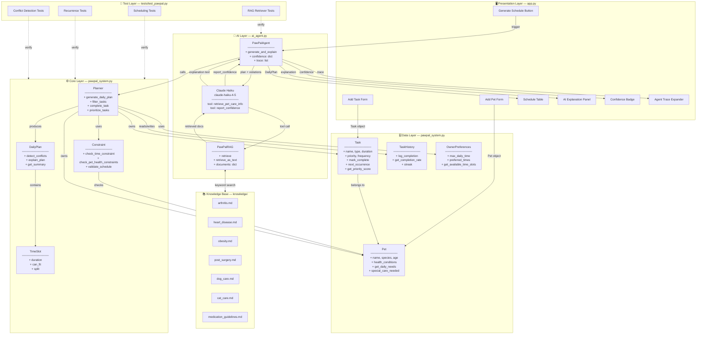

# PawPal+ System Architecture

## Component & Layer Diagram

---

## Layer Responsibilities

| Layer | Files | Purpose |
|---|---|---|
| **Presentation** | `app.py` | Streamlit UI — all user input and output |
| **AI** | `ai_agent.py` | Claude agent loop, RAG retriever, confidence scoring |
| **Knowledge Base** | `knowledge/*.md` | Static pet-care documents searched by RAG |
| **Core** | `pawpal_system.py` | Rule-based scheduling, constraint checking, conflict detection |
| **Data** | `pawpal_system.py` | Domain objects: Pet, Task, TaskHistory, OwnerPreferences |
| **Test** | `tests/test_pawpal.py` | Automated verification of Core and AI layers |

---

## Key Design Boundaries

- The **AI layer never mutates** the Core or Data layers — it reads the plan and produces text.
- The **Core layer has no knowledge of Claude** — it is fully testable without an API key.
- The **RAG retriever is stateless** — it loads documents once at startup and only reads from that point on.
- The **UI is the only entry point** for user data — Pet and Task objects are created there and passed down.
